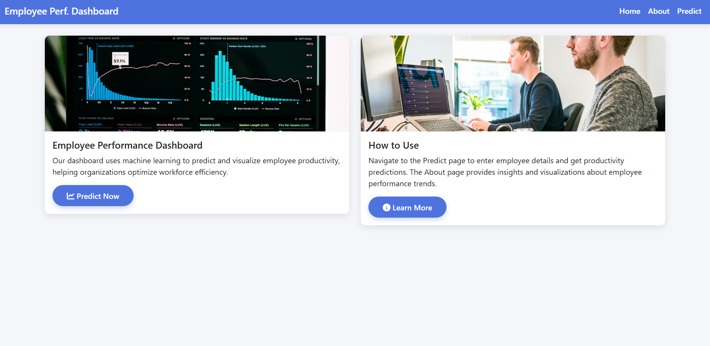
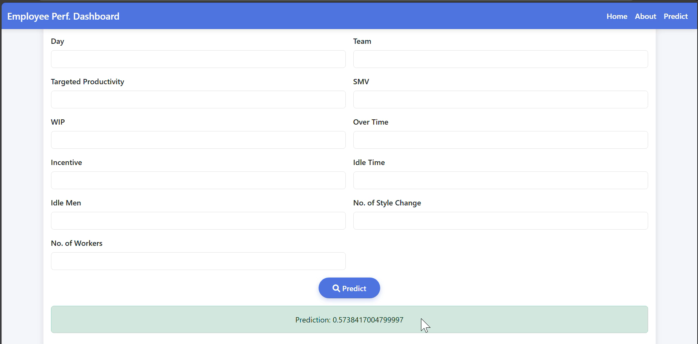

This project is an Employee Performance Prediction dashboard built with FastAPI and a machine‑learning model trained on the “Garments Worker Productivity” dataset.​

Overview
This application predicts employee productivity and visualizes key trends from a real manufacturing dataset.​
It provides a simple web interface where users can explore data insights and generate productivity predictions for different teams and departments.​

Tech Stack
Backend: FastAPI for API endpoints and server‑side rendering of HTML templates.​

Frontend: HTML, CSS, Bootstrap for responsive UI and layout.

ML / Data: pandas, scikit‑learn, NumPy, Plotly for model training and visualization.​

Model Persistence: joblib to save and load the trained model.

Dataset
The project uses the garments worker productivity dataset, which contains: date, quarter, department, day, team, targeted_productivity, smv, wip, over_time, incentive, idle_time, idle_men, no_of_style_change, no_of_workers, and actual_productivity.​
The target variable is actual_productivity, and all other columns are used as features after preprocessing and encoding.​

Project Structure
Datasets/garments_worker_productivity.csv – raw dataset.

Employee-performance-model.pkl – trained RandomForest regression model.

fastapi-server/main.py – FastAPI app, routes, data loading, model training, and prediction logic.

templates/home.html – landing page with overview and navigation cards.

templates/about.html – description and Plotly visualization of actual productivity by department.

templates/predict.html – form to collect feature inputs and display prediction result.

What Is Implemented
1. Data Preprocessing
Missing values in numerical columns (such as wip) are imputed using median values to keep distributions robust.​

Missing values in categorical columns (such as department if any) are imputed with the most frequent category.​

Categorical features (quarter, department, day) are one‑hot encoded to convert them into numeric inputs for the model.​

2. Model Training and Evaluation
A RandomForestRegressor is trained using all engineered and encoded features to predict actual_productivity.​

The data is split into training and test sets, and metrics like MAE, MSE, RMSE, and R‑squared are calculated to evaluate performance.​

The model in this project achieved approximately:

Mean Absolute Error ≈ 0.07

Root Mean Squared Error ≈ 0.11

R‑squared ≈ 0.52

This means predictions are reasonably close to the true productivity values, but there is still unexplained variance, which is typical for real‑world productivity data.​

3. FastAPI Application
At startup, the app loads the dataset, performs preprocessing, and trains (or loads) the RandomForest model before serving requests.​

The trained model is saved as Employee-performance-model.pkl, and the same preprocessing steps are applied at prediction time to keep feature alignment consistent.​

UI Pages and Screenshots
Home Page – Dashboard Intro
The home page presents two main cards:

Employee Performance Dashboard – describes that the system uses machine learning to predict and visualize employee productivity, with a “Predict Now” button linking to the prediction form.​

How to Use – explains that users should go to the Predict page to input employee and line information and that the About page contains detailed analytics and charts.​

The layout is responsive, uses a clean blue‑and‑white color scheme, and includes a top navigation bar with links to Home, About, and Predict.​

About Page – Visualization
The about page explains the purpose and scope of the project and embeds an interactive Plotly bar chart.​

The chart displays Actual Productivity by Department, aggregating productivity across sewing and finishing departments so users can quickly compare performance.

This page helps users understand high‑level patterns in the data and see which departments consistently perform better or worse.​

Predict Page – Input Form and Output
The predict page provides a responsive two‑column form with labeled fields for all important features: Quarter, Department, Day, Team, Targeted Productivity, SMV, WIP, Over Time, Incentive, Idle Time, Idle Men, No. of Style Change, and No. of Workers.​

When the user clicks the Predict button, the form sends the data to the FastAPI backend, which preprocesses the inputs, aligns columns with the training matrix, and calls the saved RandomForest model to generate a predicted productivity value.

The predicted actual_productivity is displayed in a green alert box at the bottom of the page so users immediately see the output after submission.​

How to Run the Project
Install dependencies:

bash
pip install fastapi uvicorn jinja2 pandas scikit-learn plotly joblib
Ensure the dataset CSV is in Datasets/garments_worker_productivity.csv and that main.py points to this path.

Start the FastAPI server from the folder containing main.py:

bash
uvicorn main:app --reload
Open a browser and navigate to:

http://127.0.0.1:8000/ – Home

http://127.0.0.1:8000/about – About & charts

http://127.0.0.1:8000/predict – Prediction form

What You Get as Output
A working web dashboard to explore employee productivity data, visualize departmental performance, and predict productivity for new records.
